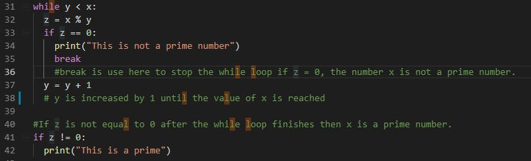
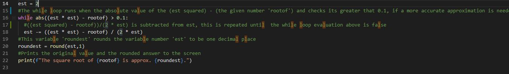
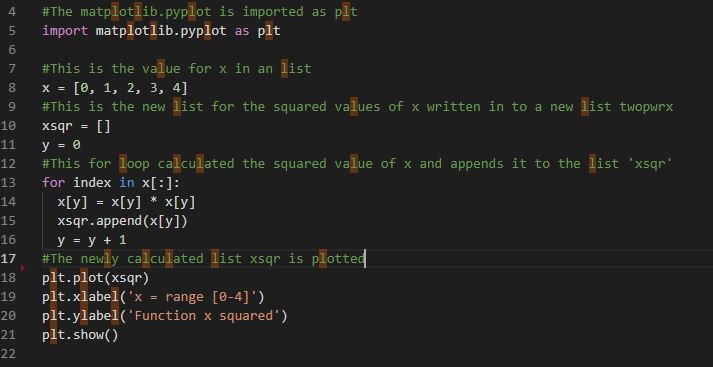
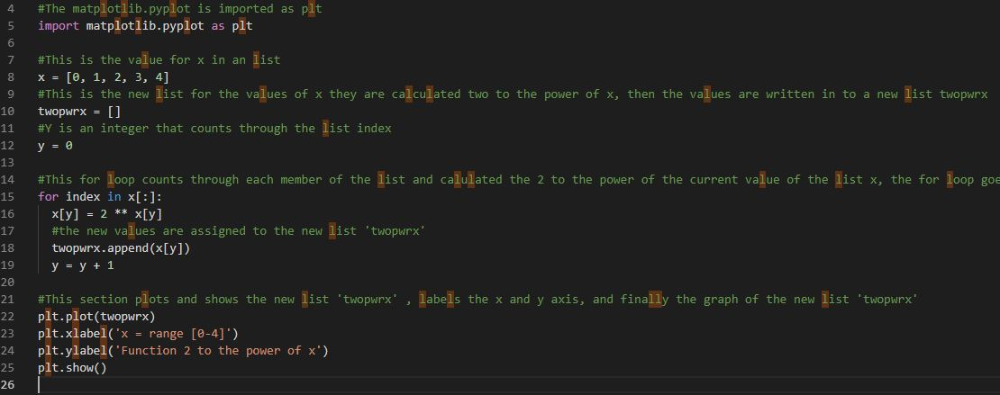
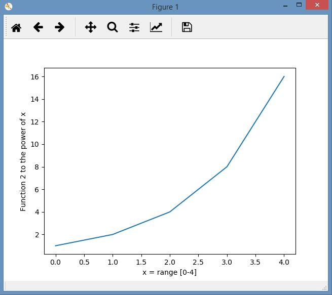

 

        
      
# Problem Set 2019

## Programming and Scripting

This file documents my solutions to each of the ten problems given in the Programming and Scripting Problem Set 2019

## Question 1 sumupto.py

This is a program that prompts for a positive integer and calculates the sum of all the number from 1 to that number, and outputs this number. The program also checks the inputed value to ensure its a positive number using a while loop and if is not it reprompts the user

The sumupto.py program is a while loop counting up and adding the sum of each of the numbers until it reaches to the entered number. This method needs three integer variables including the integer for the original number entered. 

The integer variables I used in this program are as follows:
x is the number that is entered by the user
y is used as a counter for the while loop, each time the while loop is executed the value of y is increased by 1 after the original value of y is added to z. i.e while y less than or equal to (<=) x then add the new value of y to z, 
z is the summed total of the number, the new value of y is added to this each time the while loop executes until y <= x is reached.
When y <= x exit the while loop and print z.

There is another way the same program could be written, the counter y starts with the entered number and counts down towards and including 1 this program would have needed one less variable.

## Question 2 begins-with-a-t.py
This program checks if the current day of the week begins with a T. The first working version of this program imported the module 'datetime', this however stopped working when the program for Question 8 was written as the filename datetime.py was specified in the question, once datetime.py was in the same folder as begins-with-a-t.py it caused a problem with importing the module library from the correct source. 

To overcome this, the module 'time' was imported instead. The program uses the function 'time.strftime' with the directive %w, this directive assigns a decmial number to each day of the week see below. 

Sunday = 0
Monday = 1
Tuesday = 2
Wednesday = 3
Thursday = 4
Friday = 5
Saturday = 6

The variable 'day' is assigned this decimal number, this is a string variable.

If statements are used to check is the variable 'day' either 2 or 4, if it is then the current day is Tuesday or Thursday and "Yes - today begins with a T." is printed to the screen. The else in the if statement is used when the first if statement is evaluated to false and "No - today does not begin with a T." is printed to the screen.

## Question 3: divisors.py

This program prints all numbers between 1,000 and 10,000 that are divisible
by 6 but not 12.

The solution to this problem the program uses a for loop, this for loop runs with x starting at 1000 and stopping when x was at 10000 inclusively, 10001 had to be coded in the for loop range. See image of the for loop below

In the for loop the current value of x was divided by 6 and the remainder value was assigned to y, the number x was also divided by 12 and the remainder value assigned to z. y and z are given initial values of 0 before the for loop is executed.

An if statement nested within the for loop was then used to evaluate if the current value of y was equal to 0 and z was not equal to 0, if both conditions were true then the current value of x is divisible by 6 and not divisible by 12, the current value is x is printed to the screen.  

To keep the for loop running x was incremented by 1 and it ran until x reached 10000.

The result was the program printed (on a new line) out all the values of x between 1000 and 10000 that were divisible by 6 by not by 12.

## Question 4: collatz.py

This program prompts the user to input any positive integer, then it outputs successive values of the following calculation, if the current value was even divide it by 2 and if it was odd multiply it by three and add one. THe program runs until the value of x reaches 1.

The first task in this program was to prompt the user, take in the value entered and check it its a positive number.

The while loop below checks if the value is a postive number, this is assigned to the integer variable x.

Once the positive integer is passed in by the user the while loop below is executed, the while loop divides the current value of x and determines if the integer is odd or even, by assigning the value of the remainder of the division to the variable y.  

The variable y is evaluated in an if statement within the while loop and depending on if y == 0 (even) x is divided by two or (else) x is odd and is multiplied by 3 and 1 is added. The resulting new value for x is then appended to a list 'n' each time whether its even or odd. This creates a list n with all the values of x until the while loop stops running when x reaches 1.

The resulting list n is printed out without the square brackets and the values are separate by a space this is achieved by using the print command below.

## Question 5: primes.py

This program prompts the user to input a positive integer and tells the user if its a prime number.

Like the other programs the user is prompted for a positive integer and the while loop checks if the number is positive. It re prompts the user if it is not a positive number.

The two cases for 1 and 2 are given as printed statements below

The while loop determines if the number entered is a prime number by dividing the number x by a number y and assigning it to the variable z see line 32, y = 2 at the beginning.  Each time this division occurs in the while loop the if statement checks the value of the remainder z see line 33, if z is 0 after any division then the number is not a prime number and "This is not a prime number" is printed to the screen. There is a break statement in the if statement on line 35, this breaks out of the while loop after the "This is not a prime number" is printed. y is incremented by 1 every time the while loop executes and the if statement evaluation is false see line 37.

If z is not equal to 0 after every successive division then the number is a prime number, the while loop exits when y is no longer less that x as mentioned, it is incremented by 1 every time the while loop executes.

Once the while loop finishes the if statement at the end checks the value of z if its not = 0 then the number is a prime number and "This is a prime" is printed to the screen.

## Question 6: secondstring.py

This program takes a users input string and prints out every second word. This program 

The line below takes in the text the user inputs and assigned to the string variable s

Line 8 converts the string s to a list named list.

Line 15 prints every 2nd member of the list without the square brackets separated with a space. 

## Question 7: squareroot.py

This program takes a positive floating point number from the user and outputs its square root approximation.

The algorithim for this program was given by a video lecture from Ian McLoughlin.

The first part of this program prompts the user to input a positive floating point number, this is assigned to the variable float

The floating point number is checked to ensure its a positive number if it isn't use is re prompted again.

The squareroot approximation is calculated by using the following while loop starting with an estimate(guess) of the square root value this is assigned to variable est

Line 14 sets the variable est to 2, this can be any number.

The while loop runs if the absolute value of the (est squared) - (the given number 'rootof') and checks its greater that 0.1, if a more accurate approximation is needed then 0.1 needs to be smaller eg .001 see line 16 above.

The while loop executes the algorithm to calculate the approximation see line 18

When the while loop is finished, the approximation is rounded to one decimal place in line 20.

The original number and approximation is printed with suggested text, using a print command with the f option to insert the value of the variables in line 22.

## Question 8: datetime.py

This program outputs todays days in the format Monday, January 10th 2019 at 1:15pm

The datetime module was initially used to write this program but it did not work with this program filename named datetime.py, it also broke the original solution to question2 that used the datetime module too. The solution to allow this program to be named datetime.py and be saved in the same directory was to import the time module and use functions from this module to achieve the same outcome. In line 5 below time is imported as time.

The date prefix variable is called prefix and the default string value for this variable is th, as this is most dates prefix.

The function time.strftime(%d) assigns the date number to the string variable 'day', see line 11 below.

The next few lines of code evaluate the string value of day, if its 1, 21 or 31 then prefix is changed to st and the prefix is also added to the date number variable 'day' on line 15

The same is done for 2 and 22, nd is appended on to the date variable 'day'. The same is done for the 3, 23, rd is appended to the variable 'day'. the else at the end of the if statements appends the th prefix to the day number. 

In the last section of the program a few new variables are constructed to give the correct requested date and time format in the question.

The variable 'daymonth' is created to display the month and day name, example January, Monday. see line 30
The variable 'year' is just the year expressed as a 4 digit number, see line 32
The variable 'time' is expressed as hr and minute with a colon between them, AM or PM is also appended to the right of the variable.

Finally all the string variables are printed together in order with the text 'at' between the 'year' and 'time' variables see line 37 above

## Question 9: second.py

This program takes a file name given as an argument and outputs every 2nd line to the screen.

To allow the program to take an argument that the user enters the sys module is imported see line 5 below.

The variable 'file' is assigned the 2nd argument after the program filename. 
For example from the command 'python second.py moby-dick.txt', the variable 'file' will be assigned 'moby-dick.txt'. See line 10 below

The next few lines of code open the variable 'file' as 'f', this is done the recommended way to open a file with the 'with' function see line 13. A variable 'linenumber' is assigned and set to 0, this will keeptrack of the lines read in the file. The for loop on line 17 reads in each line of the file 'f' that was opened, for each line that is read the carraige return is removed using the code in line 19. To print every 2nd line the if statement on line 21 checks if the current value of the variable 'linenumber' is odd or even, if its even it prints that line to the screen. As a result lines 0, 2, 4 ,6 etc are printed to the screen. The odd linenumbers can be printed instead by modyfing this if statement. Finally line 24 increases the value of linenumber by 1 each time the for loop executes until the last line is read from the file 'f'

## Question 10: plots.py

These programs plot the function x, x2, 2x for the values of x been in the range [0-4]

To achieve this three programs were written for each function given in the question x, x2, 2x.

The programs are saved in the folder Question10-Plots and are called
1. plot-x.py
2. plot-x-squared.py
3. plot-2-to-the-pwr-x.py

The programs are discussed below

### plot-x.py

This program takes starts by importing matplotlib.pyplot as plt see line 4. x is a list of numbers in the range 0-4. The full list x e is plotted using the code on line 8.

Lines 9 & 10 label the the x and y axis respectively. Line 11 displays the plot. 
See diagram below.

### plot-x2.py

This program starts by importing matplotlib.pyplot as plt see line 5. x is a list of numbers in the range 0-4. A new list variable 'xsqr' is created and a new variable y is also created. 

The for loop on line 13 loops through the values in the list x and squares the value, each value as its squared is appended to the new list 'xsqr' see line 15. The variable y counts through the members in the list each time the for loop runs.

In line 18 the newly squared list is plotted. 

Lines 19 & 20 label the the x and y axis respectively. Line 21 displays the plot. 
See diagram below.

### plot-2x.py

This program starts by importing matplotlib.pyplot as plt see line 5. x is a list of numbers in the range 0-4. A new list variable 'twopwrx' is created and a new variable y is also created.

The for loop on line 15 loops through the values in the list x and calculates 2 to the pwr of each value of x, each value as its calculated is appended to the new list 'twopwrx' see line 18. The variable y counts through the members in the list each time the for loop runs.

In line 22 the newly squared list is plotted.

Lines 23 & 24 label the the x and y axis respectively. Line 25 displays the plot. 
See diagram below.

